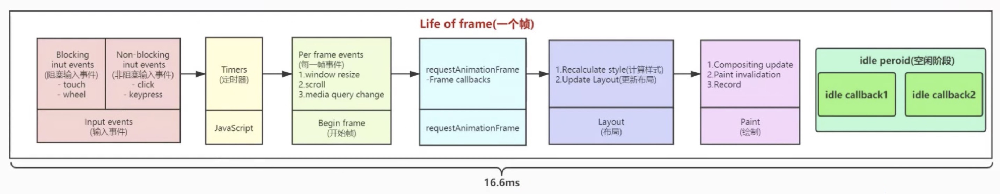
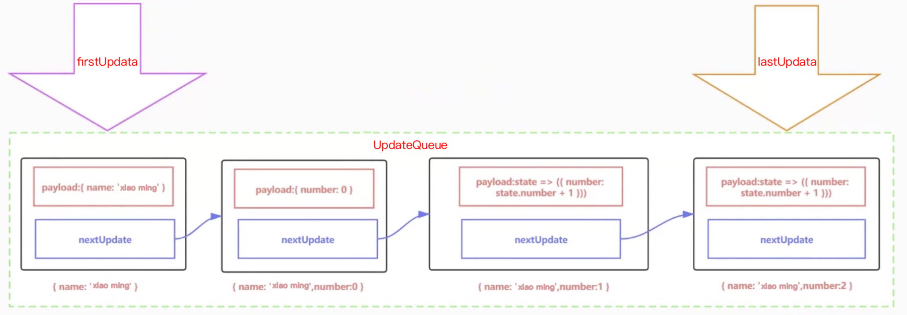
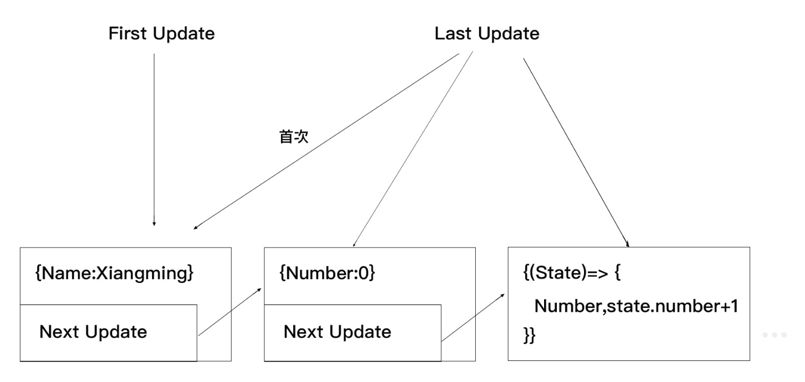
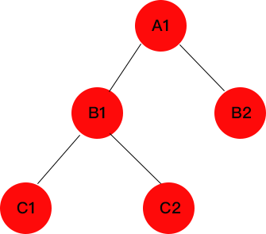
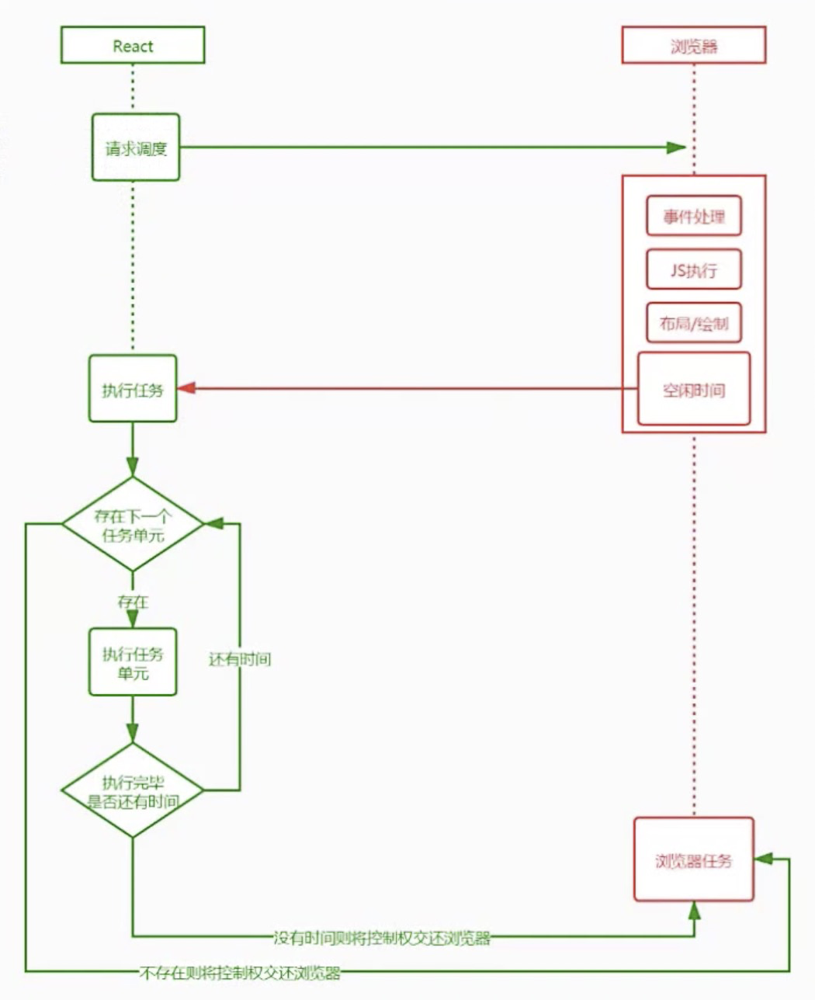
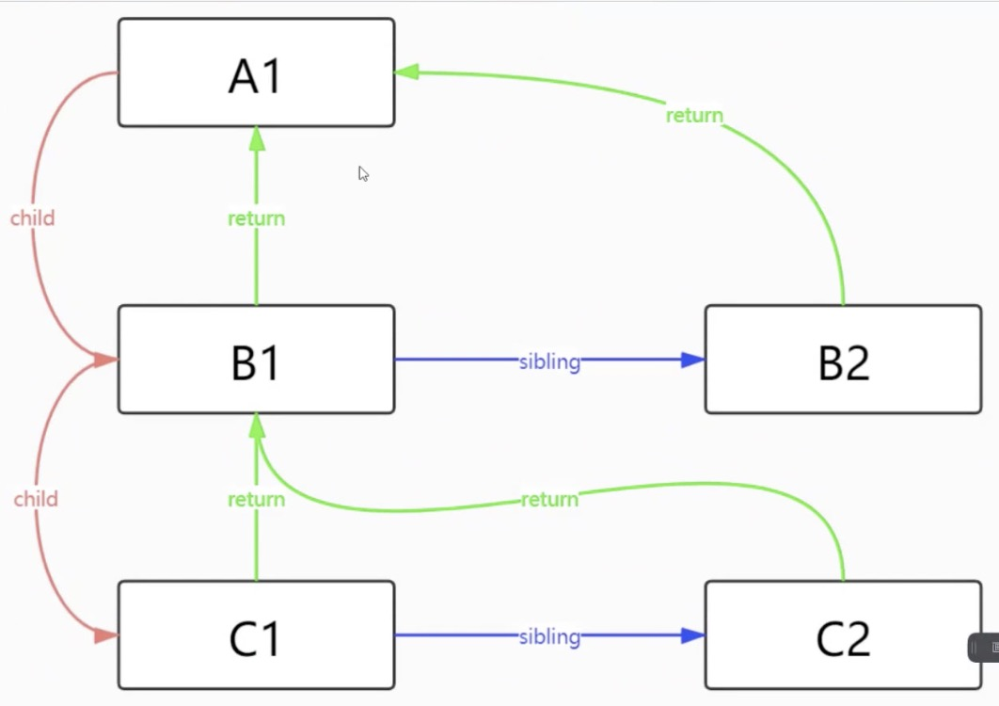
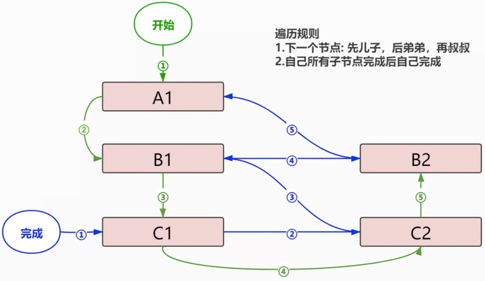

### 屏幕刷新
- 一般设备屏幕刷新速率 60次/秒
- 浏览器的渲染动画 绘制 要求频率和设备刷新率一致
- 页面当每秒绘制帧数（FPS）达到60时，页面流畅；小于60时卡顿
- 每个帧当预算时间时16.66毫秒（1秒/60），所以写代码力求一帧当工作量超过16ms

### 帧
- 每个帧的开头包括样式计算、布局和绘制
- Js执行js引擎和页面渲染引擎在同一个渲染线程，GUI渲染和JS引擎两者是互斥
- 如果某个任务执行时间过长，浏览器会推迟渲染
- 

### requestAnimationFrame(callback)
- Q：浏览器刷新频率怎么和屏幕的刷新频率同步？
- A：vSync标记符，显卡会在每一帧开始时间给浏览器发送vsync标识符

### requestIdleCallback
- 目前只要Chrome支持，fiber的基础，内部是自己实现requestIdleCallback方法
- 请求空闲回调，一个全局属性
- window.requestIdleCallback(callback, { timeout: 1000 })
- 告诉浏览器现在执行callback函数，但是它的优先级比较低；告诉浏览器可以在空闲的时候执行callback，如果超了时间就必须马上执行；{ timeout: 1000 }告诉浏览器在1000ms后，即使没有空闲时间也得执行
- callback(deadline) deadline是一个对象，有两个属性：timeRemaining(): function，可以返回此帧还剩多少时间；didTimeout: boolean，此callback任务是否超时
- callback函数执行我们的任务，fiber是把整个任务分成很多小任务（requestIdleCallback来调度，任务：其实理解成一个虚拟DOM节点），每次执行一个任务，执行完成后看是否还有剩余时间，有继续下个任务无放弃，交给浏览器进行调度（下次执行）。

### 单链表（fiber实现）
- 是一种链式存取的数据结构
- 链表中的数据是以节点来表示的，每个节点的构成：元素+指针（指示后继元素存储数据位置），元素就是存储数据的存储单元，指针就是链家每个节点的地址
- 在fiber中，很多地方用链表，在fiber是一个虚拟DOM节点是一个单元
- 
- 以上图含有4个节点，每个节点两部分组成，payload表示数据，nextUpdate表示指针，firstUpdate（头指针指向头节点）和lastUpdate（尾指针指向最后一个节点），尾节点没有下指针。
```
class Update {
  construtor(payload, nextUpdate) {
    this.payload = payload;
    this.nextUpdate = nextUpdate; // 指向下一个节点的指针
  }
}

class UpdateQueue {
  constructor() {
    this.baseState = null; // 原状态
    this.firstUpdate = null; // 第一个更新
    this.lastUpdate = null; // 最后一个更新
  }
  enqueueUpdate(update) {
    if (this.firstUpdate === null) {
      this.firstUpdate = this.lastUpdate = update;
    } else {
      this.lastUpdate.nextUpdate = update;
      this.lastUpdate = update;
    }
  }
  forceUpdate() {
    let currentState = this.baseState || {}; // 初始状态
    let currentUpdate = this.firstUpdate;
    while(currentUpdate) {
      let nextState = typeof currentUpdate.payload === 'function' ? currentUpdate.payload(currentState) : currentUpdate.payload;
      currentState = { ...currentState, ...nextState } // 此时得到最新状态
      currentUpdate = currentUpdate.nextUpdate; // 找下个节点
    }
    this.firstUpdate = this.lastUpdate = null; // 更新完成后要把链表清空
    this.baseState = currentUpdate; // 更新更新完的基础状态
    return currentUpdate;
  }
}

const queue = new UpdateQueue();
queue.enqueueUpdate(new Update({ name: 'xiao ming' }));
queue.enqueueUpdate(new Update({ number: 0 }));
queue.enqueueUpdate(new Update((state) => ({ number: state.number + 1 })); // 计算新状态
queue.enqueueUpdate(new Update((state) => ({ number: state.number + 1 })); // 计算新状态
queue.forceUpdate();
```
- { number: 0 } setState({ number: 1 }) setState((state) => ({ number: state.number + 1 })) 每个setState都是一个Update节点，通过链表连接起来，最后在某个时间点进行合并计算新状态。例如上面，第一个{ name: 'xiao ming' }第二个{ number: 0 }第三、四个传的是函数，最终结果{ name: 'xiao ming', number: 2 }
- 

- forceUpdate 获取老的状态，然后遍历这个链表进行更新
- Q：fiber为什么使用链表
- A：因为链表可中断和恢复
- 一个虚拟DOM就是一个链表节点，是一个最小单元

### fiber
- Q：fiber之前是什么样，为什么是fiber？
- 
```
const root = {
  key: 'A1',
  children: [
    {
      key: 'B1',
      children: [
        { key: 'C1', children: [] }
        { key: 'C2', children: [] }
      ]
    },
    { key: 'B2', children: [] }
  ]
}

function walk(vnode) {
  doWork(vnode);
  vnode.children.forEach((child) => {
    walk(child);
  })
}
function doWork(vnode) {
  console.log(vnode.key) // 深度优先遍历A1 B1 C1 C2 B2，遍历兄弟广度遍历子深度
}
walk(root);
```
#### - History
- React会递归比对VNODE，找出需要变动的节点，然后同步更新他们，这个过程称为Reconcilation（协调）；在协调时间内，React会一直占用浏览器资源，则会导致用户触发事件得不到响应，所谓掉帧卡顿。
- Q：如何遍历子节点？A：深度优先遍历
- 缺点：这种遍历是递归调用，执行栈会越来越深，而且不能中断，因为中断难以恢复；例如超过一千层的子节点中断有得回来重新遍历。
#### - Now
- Fiber定义：是一个执行单元每次执行完一个执行单元（一个节点），React就会检查还剩多少时间，如果没有时间就将控制权让出。
- fiber解决执行栈不能中断的问题，通过调度策略合理分配CPU资源，从而提高用户响应速度；通过fiber Reconcilation过程可以变的可以被中断，适当的让出了CPU执行权，浏览器及时的响应用户交互
- requestIdleCallback作用：申请时间片，请求一个回调给浏览器，浏览器会在组件空闲的时候执行Callback任务
- 
- Fiber是一种数据结构：React使用链表，每个vnode节点内部表示一个Fiber
```
type Fiber = {
  type: any, // 类型
  return: Fiber, // 父节点
  child: Fiber, // 指向第一个子节点
  sibling: Fiber // 指向下一个弟弟
}
```
- 
#### - Fiber执行阶段
- 每次渲染有两次阶段：Reconciliation（协调、render阶段）和Commit（提交阶段）
- 协调阶段可以理解为Diff阶段，这个阶段可以被中断，这个阶段会找出所有节点变更，例如节点新增、删除、属性变更等，这些变更React称之为副作用（Effect）
- 提交阶段：将上一个阶段计算出来的需要处理的副作用（Effects）一次性执行。这个阶段必须同步执行，不能打断
- render阶段会构建fiber树
```
Element.js
let A1 = { type: 'div', key: 'A1' }
let B1 = { type: 'div', key: 'B1', return: A1 }
let B2 = { type: 'div', key: 'B2', return: A1 }
let c1 = { type: 'div', key: 'B1', return: B1 }
let c2 = { type: 'div', key: 'B1', return: B1 }
A1.child = B1;
B1.sibling = B2;
B1.child = C1;
C1.sibling = C2;
module.export = A1;
```
- 遍历fiber树：深度优先——先儿子 后弟弟 再叔叔
- 
```
let rootFiber = require('./Element');

let nextUnitOfWork = null;
function workLoop(deadline) {
  // while (nextUnitOfWork) { // 如果有待执行单元，执行并返回下一个执行单元
  while ((deadline.timeRemaining() > 0 || deadline.didTimeout) && nextUnitOfWork) // Q：为什么用while？
    nextUnitOfWork = performUnitOfWork(nextUnitOfWork);
  }
  if (!nextUnitOfWork) { 
    console.log('render阶段遍历结束') 
  } else {
    // 如果睡眠或是执行大于16.66ms此时执行下一个浏览器调度任务，请求下次浏览器空闲时候调用
    requestIdleCallback(workLoop, { timeout: 1000 })
  }
}
function performUnitOfWork(fiber) {
  beginWork(fiber);
  if (fiber.child) { // 如果有儿子返回大儿子
    return fiber.child;
  }
  // 如果没有儿子说明此fiber已经完成了
  while (fiber) {
    completeUnitOfWork(fiber);
    if (fiber.sibling) { // 有弟弟返回弟弟
      return fiber.sibling;
    }
    fiber = fiber.return; // C2没有下兄弟返回父亲B1，这时fiber即B1（找父级），B1的弟弟B2有即C2叔叔返回 fiber.sibling 之后B2看是否有儿子 弟弟 父亲弟弟即叔叔 但一直返回到A1上面没有了 此时为null结束
  }
}

function beginWork(fiber) { // A1 B1 C1 C2 B2
  console.log('开始', fiber.key);
}

function completeUnitOfWork(fiber) { // C1 C2 B1 B2 A1
  console.log('结束', fiber.key);
}

nextUnitOfWork = rootFiber;
// workLoop(); // 此时与requestIdleCallback联系
requestIdleCallback(workLoop, { timeout: 1000 });
```
- vnode还是有的，但会被转成fiber
- Q：render阶段结果是什么？A：effect list副作用但链表
- 优势在于requestIdleCallback不阻塞主流程，可怜callback机制
- fiber和generator相似，可中断
- Q：为什么用while？A：为了性能考虑可以执行多个任务不浪费，如deadline.timeRemaining() > 0条件下
- Q：为什么用return不用parent？A：它但解释是要返回父级节点并不是指父级，是一种指向。
- vue和react优化方向不一样，vue预判对比，没有fiber概念，vue基于模版和watch组件级更新范围小，把每个更新任务分割的足够小；react时间切片，任务还剩很大，但是分割成多个小任务，可以中断和恢复，不阻塞主进程执行高优先级任务，调setState都是从根节点更新。
- Q：会不会存在没有空闲时间执行不完怎么办？A：不会，workLoop至少会执行一个任务，如果这个任务没有时间片了就放弃，就去执行下个空闲时间片（下次浏览器空闲调度），但还会继续执行上个未完成但任务，所以说fiber可中断。