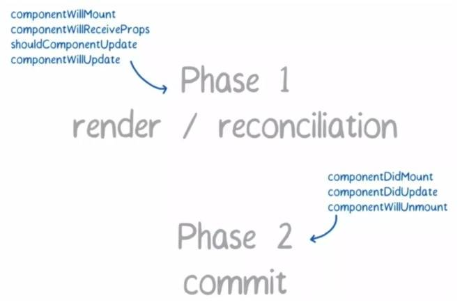
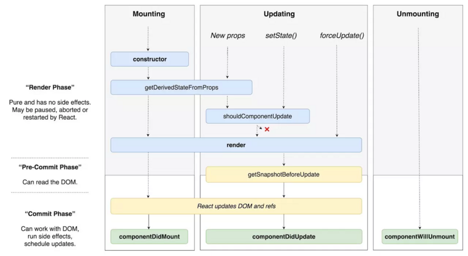

**为什么废弃一些生命周期方法**
+ 因为其在协调阶段任务可被打断的特点，任务在切片后运行完一段便将控制权交还到react负责任务调度的模块，再根据任务的优先级，继续运行后面的任务。所以会导致某些组件渲染到一半便会打断以运行其他紧急，优先级更高的任务，运行完却不会继续之前中断的部分，而是重新开始，所以在协调的所有生命周期都会面临这种被多次调用的情况。
+ 为了限制这种被多次重复调用，耗费性能的情况出现，react官方一步步把处在协调阶段的部分生命周期进行移除。

废弃：
> componentWillMount

> componentWillUpdate

> componentWillReceiveProps

新增：
> static getDerivedStateFromProps(props, state)

> getSnapshotBeforeUpdate(prevProps, prevState)

> componentDidcatch

> staic getDerivedStateFromError

**为什么新的生命周期用static**
- 通过static的写法和函数参数，可以感觉React在和我说：请只根据newProps来设定derived state，不要通过this这些东西来调用帮助方法，可能会越帮越乱。用专业术语说：getDerivedStateFromProps应该是个纯函数，没有副作用(side effect)。

**getDerivedStateFromError和componentDidCatch之间的区别是什么？**
- 因为所处阶段的不同而功能不同。getDerivedStateFromError是在reconciliation阶段触发，所以getDerivedStateFromError进行捕获错误后进行组件的状态变更，不允许出现副作用。
- componentDidCatch因为在commit阶段，因此允许执行副作用。