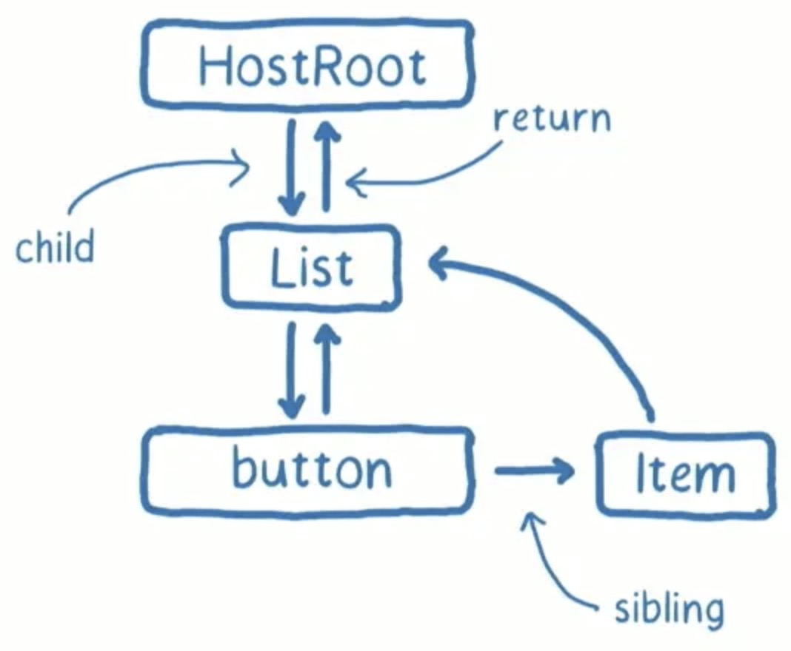
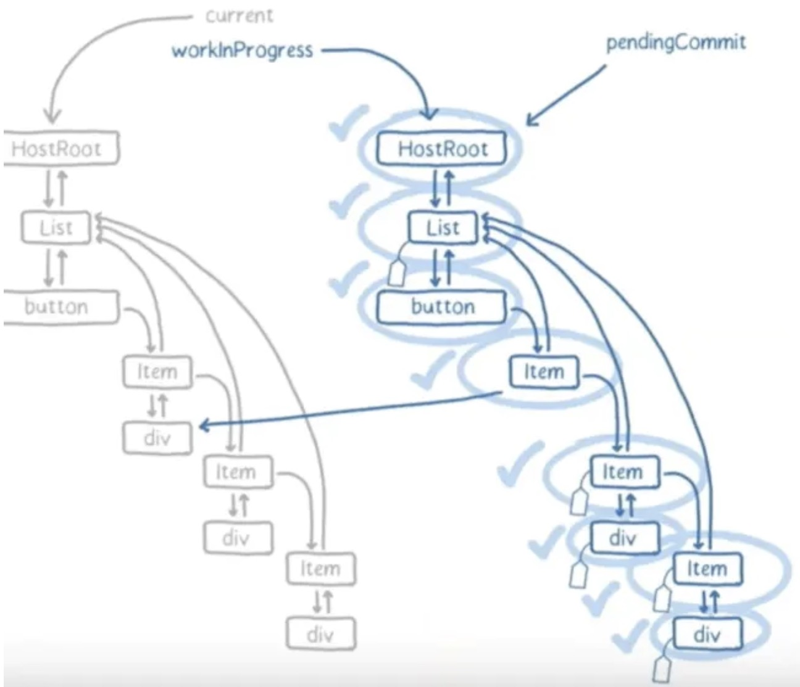
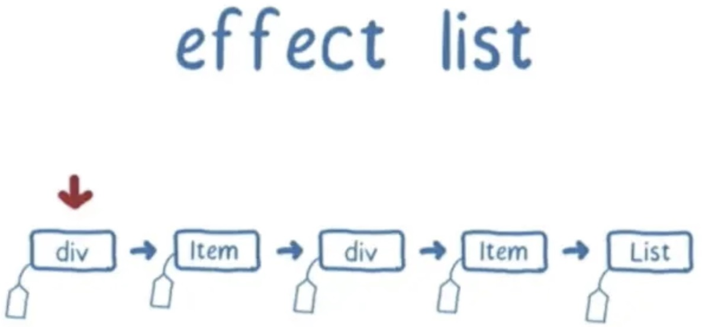
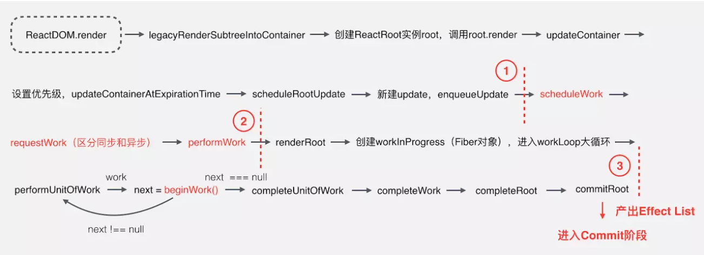
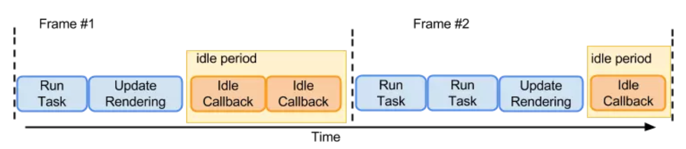

### 学习到什么？
> 介绍React重构的起因和目的，理解Fiber tree单向链表结构中各属性含义，梳理调度过程和核心实现手段，深入新的生命周期，hooks，suspense，异常捕获等特性的用法和原理。

在react刚出的时候，最具有特性就是虚拟dom，相比以往告诉浏览器需要如何更新UI，现在只需要告诉react应用UI的下个状态是怎么样的，react会帮我们自动处理两者之间的所有事宜。可以从属性操作、事件处理和手动DOM更新这些在构建应用程序时必要的操作中解放出来。同时我们开发体验时，也存在一些问题：
+ 是什么导致了react用户交互、动画频繁卡顿
+ 如何视线优雅的异常处理，进行异常捕获和备用UI渲染
+ 如何更好实现组件的复用和状态管理

### 出现Fiber
> Fiber是对React核心算法的重构，2年重构的产物就是Fiber reconciler。

### React协调是什么?
- 
> 协调是react中重要的一部分，其中包含了如何对新旧树差异进行比较以达到仅更新差异的部分。

重构后Reconciliation和Rendering被分为两个不同的阶段:
- reconciler协调阶段：在组件初次初始化和其后的状态更新中，React会创建两颗不相同的虚拟树，React需要基于这两棵树之间的差别来判断如何有效率的更新UI以保证当前UI与最新的树保持同步，计算树哪些部分需要更新。
- renderer阶段：渲染器负责将拿到的虚拟组件树信息，根据其对应环境真实地更新渲染到应用中。

### 为什么要重写协调？
> 动画是指由许多帧静止的画面，以一定的速度（如每秒16张）连续播放时，肉眼因视觉残象产生错觉，而误以为画面活动的作品。——维基百科
* 帧：在动画过程中，每一幅静止画面即为一“帧”；
* 帧率：是用于测量显示帧数的量度，测量单位为“每秒显示帧数”（Frame per Second，FPS）或“赫兹”；
* 帧时长：即每一幅静止画面的停留时间，单位一般是ms(毫秒)；
* 丢帧：在帧率固定的动画中，某一帧的时长远高于平均帧时长，导致其后续数帧被挤压而丢失的现象；
> 当前大部分笔记本电脑和手机的常见帧率为60hz，即一秒显示60帧的画面，一帧停留的时间为16.7ms(1000/60≈16.7)，这就留给了开发者和UI系统大约16.67ms来完成生成一张静态图片（帧）所需要的所有工作。如果在这分派的16.67ms之内没有能够完成这些工作，就会引发‘丢帧’的后果，使界面表现的不够流畅。

在浏览器中GUI渲染引擎线程与JS引擎线程是互斥的，当JS引擎执行时GUI线程会被挂起（相当于被冻结了），GUI更新会被保存在一个队列中等到JS引擎空闲时立即被执行。React16 推出Fiber之前协调算法是Stack Reconciler，即递归遍历所有的 Virtual DOM 节点执行Diff算法，一旦开始便无法中断，直到整颗虚拟dom树构建完成后才会释放主线程，因其JavaScript单线程的特点，若当下组件具有复杂的嵌套和逻辑处理，diff便会堵塞UI进程，使动画和交互等优先级相对较高的任务无法立即得到处理，造成页面卡顿掉帧，影响用户体验。
> Q:16年在facebook正式提到了Fiber这个概念，解释为什么要重写框架?
```
Once you have each stack frame as an object on the heap you can do clever things like reusing it during future updates and yielding to the event loop without losing any of your currently in progress data.
一旦将每个堆栈帧作为堆上的对象，您就可以做一些聪明的事情，例如在将来的更新中重用它并暂停于事件循环，而不会丢失任何当前正在进行的数据。
```
- tip:浏览器的主线程需要处理GUI描绘，时间器处理，事件处理，JS执行，远程资源加载等，当做某件事，只有将它做完才能做下一件事。如果有足够的时间，浏览器是会对我们的代码进行编译优化（JIT）及进行热代码优化，一些DOM操作，内部也会对reflow进行处理。reflow是一个性能黑洞，很可能让页面的大多数元素进行重新布局。

### React Fiber是什么？
> 首先看看解决方案的Fiber是什么？分析为什么它能解决以上问题？

定义：
+ React Reconciliation协调核心算法的一次重新实现
+ 虚拟堆栈帧
+ 具备扁平化的链表数据存储结构的JS对象，Reconciliation阶段所能拆分的最小工作单元

虚拟堆栈帧：
+ Fiber是堆栈的重新实现，专门用于React组件。可以将单个Fiber视为虚拟堆栈框架。重新实现堆栈的优点是，可以将堆栈帧保留在内存中，并根据需要（以及在任何时候）执行它们。这对于实现调度的目标至关重要。

**JavaScript的执行模型：call stack**
- JavaScript原生的执行模型：通过调用栈来管理函数执行状态。其中每个栈帧表示一个工作单元（a unit of work），存储了函数调用的返回指针、当前函数、调用参数、局部变量等信息。因为JavaScript的执行栈是由引擎管理的，执行栈一旦开始，就会一直执行，直到执行栈清空，无法按需中止。以往的React渲染就是使用原生执行栈来管理组件树的递归渲染，当其层次较深component不断递归子节点，无法被打断就会导致主线程堵塞UI卡顿。


**可控的调用栈**
- 所以理想状况下reconciliation的过程应该是像下图所示一样，将繁重的任务划分成一个个小的工作单元，做完后能够“喘口气儿”。我们需要一种增量渲染的调度，Fiber就是重新实现一个堆栈帧的调度，这个堆栈帧可以按照自己的调度算法执行他们。另外由于这些堆栈是可中断的任务拆分成多个子任务，通过按照优先级来自由调度子任务，分段更新，从而将之前的同步渲染改为异步渲染。它的特性就是时间分片(time slicing)和暂停(supense)。


**链表数据存储结构的JS对象**
- fiber是一个js对象，fiber的创建是通过React元素来创建的，在整个React构建的虚拟DOM树中，每一个元素都对应有一个fiber，从而构建了一棵fiber树，每个fiber不仅仅包含每个元素的信息，还包含更多的信息，以方便Scheduler来进行调度。
+ 简单fiber的结构：
```
type Fiber = {|
  // 标记不同的组件类型
  //export const FunctionComponent = 0;
  //export const ClassComponent = 1;
  //export const HostRoot = 3； 可以理解为这个fiber是fiber树的根节点，根节点可以嵌套在子树中
  //export const Fragment = 7;
  //export const SuspenseComponent = 13;
  //export const MemoComponent = 14;
  //export const LazyComponent = 16;
  tag: WorkTag,

  // ReactElement里面的key
  // 唯一标示。我们在写React的时候如果出现列表式的时候，需要制定key，这key就是对应元素的key。
  key: null | string,

  // ReactElement.type，也就是我们调用`createElement`的第一个参数
  elementType: any,

  // The resolved function/class/ associated with this fiber.
  // 异步组件resolved之后返回的内容，一般是`function`或者`class`
  type: any,

  // The local state associated with this fiber.
  // 跟当前Fiber相关本地状态（比如浏览器环境就是DOM节点）
  // 当前组件实例的引用
  stateNode: any,

  // 指向他在Fiber节点树中的`parent`，用来在处理完这个节点之后向上返回
  return: Fiber | null,

  // 单链表树结构
  // 指向自己的第一个子节点
  child: Fiber | null,
  // 指向自己的兄弟结构
  // 兄弟节点的return指向同一个父节点
  sibling: Fiber | null,
  index: number,

  // ref属性
  ref: null | (((handle: mixed) => void) & {_stringRef: ?string}) | RefObject,

  // 新的变动带来的新的props
  pendingProps: any, 
  // 上一次渲染完成之后的props
  memoizedProps: any,

  // 该Fiber对应的组件产生的Update会存放在这个队列里面
  updateQueue: UpdateQueue<any> | null,

  // 上一次渲染的时候的state
  // 用来存放某个组件内所有的 Hook 状态
  memoizedState: any,

  // 一个列表，存放这个Fiber依赖的context
  firstContextDependency: ContextDependency<mixed> | null,

  // 用来描述当前Fiber和他子树的`Bitfield`
  // 共存的模式表示这个子树是否默认是异步渲染的
  // Fiber被创建的时候他会继承父Fiber
  // 其他的标识也可以在创建的时候被设置
  // 但是在创建之后不应该再被修改，特别是他的子Fiber创建之前
  //用来描述fiber是处于何种模式。用二进制位来表示（bitfield），后面通过与来看两者是否相同//这个字段其实是一个数字.实现定义了一下四种//NoContext: 0b000->0//AsyncMode: 0b001->1//StrictMode: 0b010->2//ProfileMode: 0b100->4
  mode: TypeOfMode,

  // Effect
  // 用来记录Side Effect具体的执行的工作的类型：比如Placement，Update等等
  effectTag: SideEffectTag,

  // 单链表用来快速查找下一个side effect
  nextEffect: Fiber | null,

  // 子树中第一个side effect
  firstEffect: Fiber | null,
  // 子树中最后一个side effect
  lastEffect: Fiber | null,

  // 代表任务在未来的哪个时间点应该被完成
  // 不包括他的子树产生的任务
  // 通过这个参数也可以知道是否还有等待暂停的变更、没有完成变更。
  // 这个参数一般是UpdateQueue中最长过期时间的Update相同，如果有Update的话。
  expirationTime: ExpirationTime,

  // 快速确定子树中是否有不在等待的变化
  childExpirationTime: ExpirationTime,

  //当前fiber对应的工作中的Fiber。
  // 在Fiber树更新的过程中，每个Fiber都会有一个跟其对应的Fiber
  // 我们称他为 current <==> workInProgress
  // 在渲染完成之后他们会交换位置
  alternate: Fiber | null,
  ...
|};
```
**链表结构**



- fiber中最为重要的是return、child、sibling指针，连接父子兄弟节点以构成一颗单链表fiber树，其扁平化的单链表结构的特点将以往递归遍历改为了循环遍历，实现深度优先遍历。
- React16特别青睐于链表结构，链表在内存里不是连续的，动态分配、增删方便、轻量化、对异步友好。

**current与workInProgress**
- current树：React在render第一次渲染时，会通过React.createElement创建一颗Element树，可以称之为Virtual DOM Tree，由于要记录上下文信息，加入了Fiber，每一个Element会对应一个Fiber Node，将Fiber Node链接起来的结构成为Fiber Tree。它反映了用于渲染UI和映射应用状态。这棵树通常被称为current树（当前树，记录当前页面的状态）。
- workInProgress树：当React经过current当前树时，对于每一个先存在的fiber节点，它都会创建一个替代（alternate）节点，这些节点组成了workInProgress树。这个节点是使用render方法返回的React元素的数据创建的。一旦更新处理完以及所有相关工作完成，React就有一颗替代树来准备刷新屏幕。一旦这颗workInProgress树渲染（render）在屏幕上，它便成了当前树。下次进来会把current状态复制到WIP上，进行交互复用，而不用每次更新的时候都创建一个新的对象，消耗性能。这种同时缓存两棵树进行引用替换的技术被称为**双缓冲技术**。
```
function createWorkInProgress(current, ...) {
  let workInProgress = current.alternate;
  if (workInProgress === null) {
    workInProgress = createFiber(...);
  }
  ...
  workInProgress.alternate = current;
  current.alternate = workInProgress;
  ...
  return workInProgress;
}
```


- alternate fiber可以理解为一个fiber版本池，用于交替记录组件更新（切分任务后变成多阶段更新）过程中fiber的更新，因为在组件更新的各阶段，更新前及更新过程中fiber状态并不一致，在需要恢复时（如发生冲突），即可使用另一者直接回退至上一版本fiber。简单的说，如Git功能分支，你可以将WIP树想象成从旧树中Fork出来的功能分支，你在这新分支中添加或移除特性，即使是操作失误也不会影响旧的分支。当你这个分支经过了测试和完善，就可以合并到旧分支，将其替换掉。

**Update**
- 用于记录组件状态的改变
- 存放于fiber的updateQueue里面
- 多个update同时存在
- 比如设置三个setState()，React是不会立即更新的，而是放到UpdateQueue中，再去更新
```
export function createUpdate(
  expirationTime: ExpirationTime,
  suspenseConfig: null | SuspenseConfig,
): Update<*> {
  let update: Update<*> = {
    //任务过期事件
    //在创建每个更新的时候，需要设定过期时间，过期时间也就是优先级。过期时间越长，就表示优先级越低。
    expirationTime,
    // suspense的配置
    suspenseConfig,

  // export const UpdateState = 0; 表示更新State
  // export const ReplaceState = 1; 表示替换State
  // export const ForceUpdate = 2; 强制更新
  // export const CaptureUpdate = 3; 捕获更新（发生异常错误的时候发生）
  // 指定更新的类型，值为以上几种
    tag: UpdateState,
    // 更新内容，比如`setState`接收的第一个参数
    payload: null,
    // 更新完成后的回调，`setState`，`render`都有
    callback: null,

    // 指向下一个update
    // 单链表update queue通过 next串联
    next: null,
    
    // 下一个side effect
    // 最新源码被抛弃 next替换
    //nextEffect: null,
  };
  return update;
}
```
- update中的payload：通常我们现在在调用setState传入的是一个对象，但在使用fiber conciler时，必须传入一个函数，函数的返回值是要更新的state。react从很早的版本就开始支持这种写法了，不过通常没有人用。在之后的react版本中，可能会废弃直接传入对象的写法。
```
setState({}, callback); // stack conciler
setState(() => { return {} }, callback); // fiber conciler
```
**UpdateQueue**
```
//创建更新队列
export function createUpdateQueue<State>(baseState: State): UpdateQueue<State> {
  const queue: UpdateQueue<State> = {
    //应用更新后的state
    baseState,
    //队列中的第一个update
    firstUpdate: null,
    //队列中的最后一个update
    lastUpdate: null,
     //队列中第一个捕获类型的update
    firstCapturedUpdate: null,
    //队列中最后一个捕获类型的update
    lastCapturedUpdate: null,
    //第一个side effect
    firstEffect: null,
    //最后一个side effect
    lastEffect: null,
    firstCapturedEffect: null,
    lastCapturedEffect: null,
  };
  return queue;
}
```
**Updater**
- 每个组件都会有一个Updater对象，它的用处就是把组件元素更新和对应的fiber关联起来。监听组件元素的更新，并把对应的更新放入该元素对应的fiber的UpdateQueue里面，并且调用ScheduleWork方法，把最新的fiber让scheduler去调度工作。
```
const classComponentUpdater = {
  isMounted,
  enqueueSetState(inst, payload, callback) {
    const fiber = getInstance(inst);
    const currentTime = requestCurrentTimeForUpdate();
    const suspenseConfig = requestCurrentSuspenseConfig();
    const expirationTime = computeExpirationForFiber(
      currentTime,
      fiber,
      suspenseConfig,
    );

    const update = createUpdate(expirationTime, suspenseConfig);
    update.payload = payload;
    if (callback !== undefined && callback !== null) {
      if (__DEV__) {
        warnOnInvalidCallback(callback, 'setState');
      }
      update.callback = callback;
    }

    enqueueUpdate(fiber, update);
    scheduleWork(fiber, expirationTime);
  },
  enqueueReplaceState(inst, payload, callback) {
    //一样的代码
    //...
    update.tag = ReplaceState;
    //...
  },
  enqueueForceUpdate(inst, callback) {
    //一样的代码
    //...
    update.tag = ForceUpdate;
    //...
  },
};
```
**Effect list**
- **Side Effects**:我们可以将React中的一个组件视为一个使用state和props来计算UI的函数。每种操作，如改变DOM或调用生命周期方法，都应该被认为是side-effects。
- React能够非常快速地更新，并且为了实现高性能，其中之一是构建带有side-effects的fiber节点的线性列表，其具有快速迭代的效果。迭代线性列表比树快得多，并且没有必要在没有side effects的节点上花费时间。
- 每个fiber节点都可以具有与之相关的effects, 通过fiber节点中的effectTag字段表示。




- 此列表的目标是标记具有DOM更新或与其关联的其他effects的节点，此列表是WIP tree的子集，并使用nextEffect属性，而不是current和workInProgress树中使用的child属性进行链接。

### How it work
> 把可中断的工作拆分成多个小任务

> 为不同类型的更新分配任务优先级

> 更新时能够暂停，终止，复用渲染任务

**更新过程：更新过程分为两个阶段：reconciler 和 commit**
> reconciler阶段



- 从ReactDOM.render()方法开始，把接收的React Element转换为Fiber节点，并为其设置优先级，记录update等。这部分主要是一些数据方面的准备工作。
- scheduleWork、requestWork、performWork，即安排工作、申请工作、正式工作三部曲。React 16新增的异步调用的功能则在这部分实现。
- 一个大循环，遍历所有的Fiber节点，通过Diff算法计算所有更新工作，产出EffectList给到commit阶段使用。这部分的核心是beginWork函数。

> commit阶段
- 这个阶段主要做的工作拿到reconciler阶段产出的所有更新工作，提交这些工作并调用渲染模块（react-dom）渲染UI。
- 完成UI渲染之后，会调用剩余的生命周期函数，所以异常处理也会在这部分进行。

**分配优先级**
> expirationTime本质上是fiber work执行的优先级。
```
//为fiber对象计算expirationTime
function computeExpirationForFiber(currentTime: ExpirationTime, fiber: Fiber) {
  ...
  // 根据调度优先级计算ExpirationTime
    const priorityLevel = getCurrentPriorityLevel();
    switch (priorityLevel) {
      case ImmediatePriority:
        expirationTime = Sync;
        break;
        //高优先级 如由用户输入设计交互的任务
      case UserBlockingPriority:
        expirationTime = computeInteractiveExpiration(currentTime);
        break;
        // 正常的异步任务
      case NormalPriority:
        // This is a normal, concurrent update
        expirationTime = computeAsyncExpiration(currentTime);
        break;
      case LowPriority:
      case IdlePriority:
        expirationTime = Never;
        break;
      default:
        invariant(
          false,
          'Unknown priority level. This error is likely caused by a bug in ' +
            'React. Please file an issue.',
        );
    }
    ...
}

export const LOW_PRIORITY_EXPIRATION = 5000
export const LOW_PRIORITY_BATCH_SIZE = 250

export function computeAsyncExpiration(
  currentTime: ExpirationTime,
): ExpirationTime {
  return computeExpirationBucket(
    currentTime,
    LOW_PRIORITY_EXPIRATION,
    LOW_PRIORITY_BATCH_SIZE,
  )
}

export const HIGH_PRIORITY_EXPIRATION = __DEV__ ? 500 : 150
export const HIGH_PRIORITY_BATCH_SIZE = 100

export function computeInteractiveExpiration(currentTime: ExpirationTime) {
  return computeExpirationBucket(
    currentTime,
    HIGH_PRIORITY_EXPIRATION,
    HIGH_PRIORITY_BATCH_SIZE,
  )
}

function computeExpirationBucket(
  currentTime,
  expirationInMs,
  bucketSizeMs,
): ExpirationTime {
  return (
    MAGIC_NUMBER_OFFSET -
    ceiling(
    // 之前的算法
     //currentTime - MAGIC_NUMBER_OFFSET + expirationInMs / UNIT_SIZE,
      MAGIC_NUMBER_OFFSET - currentTime + expirationInMs / UNIT_SIZE,
      bucketSizeMs / UNIT_SIZE,
    )
  );
}
```
```
// low
 1073741821-ceiling(1073741821-currentTime+500,25) =>
 1073741796-((1073742321-currentTime)/25 | 0)*25
// high 
1073741821-ceiling(1073741821-currentTime+15,10)
```
- 最终结果是以25为单位向上增加的，比如说我们输入102 - 126之间，最终得到的结果都是625，但是到了127得到的结果就是650了，这就是除以25取整的效果。
- 即计算出的React低优先级update的expirationTime间隔是25ms， React让两个相近（25ms内）的update得到相同的expirationTime，目的就是让这两个update自动合并成一个Update，从而达到批量更新的目的。

**执行优先级**
- Q：Fiber是如何做到异步实现不同优先级任务的协调执行的？
- A：合作式调度:这是一种’契约‘调度，要求我们的程序和浏览器紧密结合，互相信任。比如可以由浏览器给我们分配执行时间片，我们要按照约定在这个时间内执行完毕，并将控制权还给浏览器。浏览器提供的两个API：requestIdleCallback和requestAnimationFrame。

> requestIdleCallback：在浏览器空闲时段内调用的函数排队。可以使在主事件循环上执行后台和低优先级工作而不会影响延迟关键事件，如动画和输入响应。其在回调参数中IdleDeadline可以获取到当前帧剩余的时间，利用这个信息可以合理的安排当前帧需要做的事情，如果时间足够，那继续做下一个任务，如果时间不够就歇一歇。



> requestAnimationFrame：告诉浏览器希望执行动画，并且要求浏览器在下次重绘之前调用指定的回调函数从而更新动画。

- Fiber所做的就是需要分解渲染任务，然后根据优先级使用API调度，异步执行指定任务：低优先级任务由requestIdleCallback处理，限制任务执行时间，以切分任务，同时避免任务长时间执行，阻塞UI渲染而导致掉帧；高优先级任务，如动画相关的由requestAnimationFrame处理。

- 并不是所有的浏览器都支持requestIdleCallback，但是React内部实现了自己的polyfill，所以不必担心浏览器兼容性问题。polyfill实现主要是通过rAF+postmessage实现。