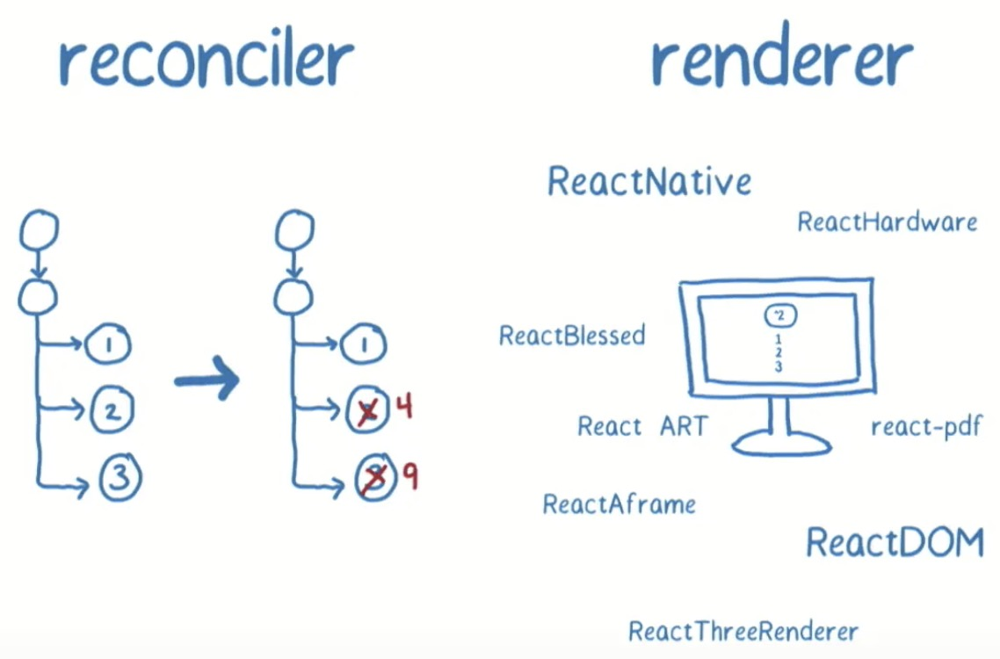
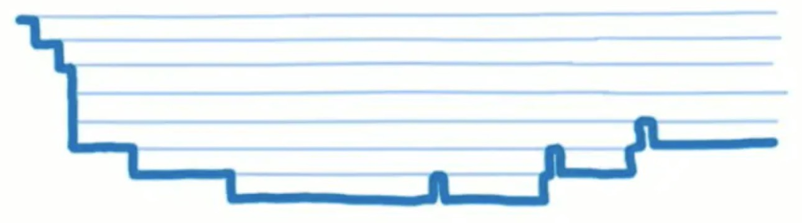
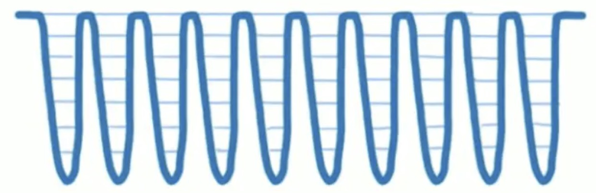

#### 学习到什么？
> 介绍React重构的起因和目的，理解Fiber tree单向链表结构中各属性含义，梳理调度过程和核心实现手段，深入新的生命周期，hooks，suspense，异常捕获等特性的用法和原理。

在react刚出的时候，最具有特性就是虚拟dom，相比以往告诉浏览器需要如何更新UI，现在只需要告诉react应用UI的下个状态是怎么样的，react会帮我们自动处理两者之间的所有事宜。可以从属性操作、事件处理和手动DOM更新这些在构建应用程序时必要的操作中解放出来。同时我们开发体验时，也存在一些问题：
+ 是什么导致了react用户交互、动画频繁卡顿
+ 如何视线优雅的异常处理，进行异常捕获和备用UI渲染
+ 如何更好实现组件的复用和状态管理

#### 出现Fiber
> Fiber是对React核心算法的重构，2年重构的产物就是Fiber reconciler。

#### React协调是什么?
- 
> 协调是react中重要的一部分，其中包含了如何对新旧树差异进行比较以达到仅更新差异的部分。

重构后Reconciliation和Rendering被分为两个不同的阶段:
- reconciler协调阶段：在组件初次初始化和其后的状态更新中，React会创建两颗不相同的虚拟树，React需要基于这两棵树之间的差别来判断如何有效率的更新UI以保证当前UI与最新的树保持同步，计算树哪些部分需要更新。
- renderer阶段：渲染器负责将拿到的虚拟组件树信息，根据其对应环境真实地更新渲染到应用中。

#### 为什么要重写协调？
> 动画是指由许多帧静止的画面，以一定的速度（如每秒16张）连续播放时，肉眼因视觉残象产生错觉，而误以为画面活动的作品。——维基百科
* 帧：在动画过程中，每一幅静止画面即为一“帧”；
* 帧率：是用于测量显示帧数的量度，测量单位为“每秒显示帧数”（Frame per Second，FPS）或“赫兹”；
* 帧时长：即每一幅静止画面的停留时间，单位一般是ms(毫秒)；
* 丢帧：在帧率固定的动画中，某一帧的时长远高于平均帧时长，导致其后续数帧被挤压而丢失的现象；
> 当前大部分笔记本电脑和手机的常见帧率为60hz，即一秒显示60帧的画面，一帧停留的时间为16.7ms(1000/60≈16.7)，这就留给了开发者和UI系统大约16.67ms来完成生成一张静态图片（帧）所需要的所有工作。如果在这分派的16.67ms之内没有能够完成这些工作，就会引发‘丢帧’的后果，使界面表现的不够流畅。

在浏览器中GUI渲染引擎线程与JS引擎线程是互斥的，当JS引擎执行时GUI线程会被挂起（相当于被冻结了），GUI更新会被保存在一个队列中等到JS引擎空闲时立即被执行。React16 推出Fiber之前协调算法是Stack Reconciler，即递归遍历所有的 Virtual DOM 节点执行Diff算法，一旦开始便无法中断，直到整颗虚拟dom树构建完成后才会释放主线程，因其JavaScript单线程的特点，若当下组件具有复杂的嵌套和逻辑处理，diff便会堵塞UI进程，使动画和交互等优先级相对较高的任务无法立即得到处理，造成页面卡顿掉帧，影响用户体验。
> Q:16年在facebook正式提到了Fiber这个概念，解释为什么要重写框架?
```
Once you have each stack frame as an object on the heap you can do clever things like reusing it during future updates and yielding to the event loop without losing any of your currently in progress data.
一旦将每个堆栈帧作为堆上的对象，您就可以做一些聪明的事情，例如在将来的更新中重用它并暂停于事件循环，而不会丢失任何当前正在进行的数据。
```
- tip:浏览器的主线程需要处理GUI描绘，时间器处理，事件处理，JS执行，远程资源加载等，当做某件事，只有将它做完才能做下一件事。如果有足够的时间，浏览器是会对我们的代码进行编译优化（JIT）及进行热代码优化，一些DOM操作，内部也会对reflow进行处理。reflow是一个性能黑洞，很可能让页面的大多数元素进行重新布局。

#### React Fiber是什么？
> 首先看看解决方案的Fiber是什么？分析为什么它能解决以上问题？

定义：
+ React Reconciliation协调核心算法的一次重新实现
+ 虚拟堆栈帧
+ 具备扁平化的链表数据存储结构的JS对象，Reconciliation阶段所能拆分的最小工作单元

虚拟堆栈帧：
+ Fiber是堆栈的重新实现，专门用于React组件。可以将单个Fiber视为虚拟堆栈框架。重新实现堆栈的优点是，可以将堆栈帧保留在内存中，并根据需要（以及在任何时候）执行它们。这对于实现调度的目标至关重要。

**JavaScript的执行模型：call stack**
- JavaScript原生的执行模型：通过调用栈来管理函数执行状态。其中每个栈帧表示一个工作单元（a unit of work），存储了函数调用的返回指针、当前函数、调用参数、局部变量等信息。因为JavaScript的执行栈是由引擎管理的，执行栈一旦开始，就会一直执行，直到执行栈清空，无法按需中止。以往的React渲染就是使用原生执行栈来管理组件树的递归渲染，当其层次较深component不断递归子节点，无法被打断就会导致主线程堵塞UI卡顿。


**可控的调用栈**
- 所以理想状况下reconciliation的过程应该是像下图所示一样，将繁重的任务划分成一个个小的工作单元，做完后能够“喘口气儿”。我们需要一种增量渲染的调度，Fiber就是重新实现一个堆栈帧的调度，这个堆栈帧可以按照自己的调度算法执行他们。另外由于这些堆栈是可中断的任务拆分成多个子任务，通过按照优先级来自由调度子任务，分段更新，从而将之前的同步渲染改为异步渲染。它的特性就是时间分片(time slicing)和暂停(supense)。


**链表数据存储结构的JS对象**
- fiber是一个js对象，fiber的创建是通过React元素来创建的，在整个React构建的虚拟DOM树中，每一个元素都对应有一个fiber，从而构建了一棵fiber树，每个fiber不仅仅包含每个元素的信息，还包含更多的信息，以方便Scheduler来进行调度。
+ 简单fiber的结构：
```
type Fiber = {|
  // 标记不同的组件类型
  //export const FunctionComponent = 0;
  //export const ClassComponent = 1;
  //export const HostRoot = 3； 可以理解为这个fiber是fiber树的根节点，根节点可以嵌套在子树中
  //export const Fragment = 7;
  //export const SuspenseComponent = 13;
  //export const MemoComponent = 14;
  //export const LazyComponent = 16;
  tag: WorkTag,

  // ReactElement里面的key
  // 唯一标示。我们在写React的时候如果出现列表式的时候，需要制定key，这key就是对应元素的key。
  key: null | string,

  // ReactElement.type，也就是我们调用`createElement`的第一个参数
  elementType: any,

  // The resolved function/class/ associated with this fiber.
  // 异步组件resolved之后返回的内容，一般是`function`或者`class`
  type: any,

  // The local state associated with this fiber.
  // 跟当前Fiber相关本地状态（比如浏览器环境就是DOM节点）
  // 当前组件实例的引用
  stateNode: any,

  // 指向他在Fiber节点树中的`parent`，用来在处理完这个节点之后向上返回
  return: Fiber | null,

  // 单链表树结构
  // 指向自己的第一个子节点
  child: Fiber | null,
  // 指向自己的兄弟结构
  // 兄弟节点的return指向同一个父节点
  sibling: Fiber | null,
  index: number,

  // ref属性
  ref: null | (((handle: mixed) => void) & {_stringRef: ?string}) | RefObject,

  // 新的变动带来的新的props
  pendingProps: any, 
  // 上一次渲染完成之后的props
  memoizedProps: any,

  // 该Fiber对应的组件产生的Update会存放在这个队列里面
  updateQueue: UpdateQueue<any> | null,

  // 上一次渲染的时候的state
  // 用来存放某个组件内所有的 Hook 状态
  memoizedState: any,

  // 一个列表，存放这个Fiber依赖的context
  firstContextDependency: ContextDependency<mixed> | null,

  // 用来描述当前Fiber和他子树的`Bitfield`
  // 共存的模式表示这个子树是否默认是异步渲染的
  // Fiber被创建的时候他会继承父Fiber
  // 其他的标识也可以在创建的时候被设置
  // 但是在创建之后不应该再被修改，特别是他的子Fiber创建之前
  //用来描述fiber是处于何种模式。用二进制位来表示（bitfield），后面通过与来看两者是否相同//这个字段其实是一个数字.实现定义了一下四种//NoContext: 0b000->0//AsyncMode: 0b001->1//StrictMode: 0b010->2//ProfileMode: 0b100->4
  mode: TypeOfMode,

  // Effect
  // 用来记录Side Effect具体的执行的工作的类型：比如Placement，Update等等
  effectTag: SideEffectTag,

  // 单链表用来快速查找下一个side effect
  nextEffect: Fiber | null,

  // 子树中第一个side effect
  firstEffect: Fiber | null,
  // 子树中最后一个side effect
  lastEffect: Fiber | null,

  // 代表任务在未来的哪个时间点应该被完成
  // 不包括他的子树产生的任务
  // 通过这个参数也可以知道是否还有等待暂停的变更、没有完成变更。
  // 这个参数一般是UpdateQueue中最长过期时间的Update相同，如果有Update的话。
  expirationTime: ExpirationTime,

  // 快速确定子树中是否有不在等待的变化
  childExpirationTime: ExpirationTime,

  //当前fiber对应的工作中的Fiber。
  // 在Fiber树更新的过程中，每个Fiber都会有一个跟其对应的Fiber
  // 我们称他为 current <==> workInProgress
  // 在渲染完成之后他们会交换位置
  alternate: Fiber | null,
  ...
|};
```